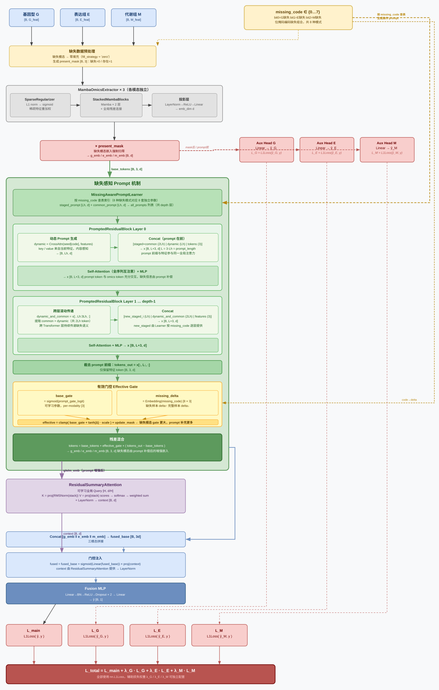

# OmicMAP

OmicMAP is a missing-aware prompt-guided multi-omics phenotype prediction framework. It models genomics, transcriptomics, and metabolomics inputs with modality-specific encoders, keeps a fixed token position for each omics modality, and uses learnable prompts to compensate missing modalities in latent space before cross-modal fusion.



## Key Ideas

- Fixed modality tokens for genomics (G), transcriptomics (T), and metabolomics (M).
- Zero-filled placeholders for missing modalities instead of deleting missing-token positions.
- Missing-aware prompts, including staged, common, dynamic, and deeper correlation prompts.
- Prompt-gated residual updates that strengthen missing-token compensation while limiting perturbation of observed modalities.
- Summary residual attention for compact cross-modal context fusion.
- Auxiliary single-modality losses during training to regularize modality encoders.

## Repository Layout

```text
.
|-- omicmap/                    # Core package: model, preprocessing, metrics, train/eval entry points
|-- configs/                    # Clean training configs
|-- scripts/                    # Thin command-line wrappers
|-- docs/                       # Method/data documentation and figures
|-- data/                       # Place dataset files here; real data are intentionally not committed
|-- tests/                      # Lightweight import checks
|-- METHOD.md                   # Manuscript-style method description
`-- README.md
```

## Installation

Python 3.10+ is recommended. GPU training requires a PyTorch/CUDA environment compatible with `mamba-ssm`.

```bash
python -m venv .venv

# Linux/macOS
source .venv/bin/activate

# Windows PowerShell
# .\.venv\Scripts\Activate.ps1

pip install -r requirements.txt
```

## Data

Place the aligned rice multi-omics files under `data/`:

```text
data/
|-- Rice_geno_zhuanzhi.csv
|-- Rice-Expression_zhaunzhi.csv
|-- Rice_Metabolites_zhuanzhi.csv
|-- Rice-Phenotypes.csv
`-- CVFs.csv
```

See `docs/DATA.md` for the expected schema. The original data files are not included in this clean release because data redistribution permissions should be checked before public upload.

## Quick Check

After adding data files, run a one-epoch smoke test:

```bash
python -m omicmap.train_cv --config configs/quick_test.yaml --trait_name yd
```

Outputs are written to `outputs/quick_test/`.

## Training

Complete-modality training for one target:

```bash
python -m omicmap.train_cv --config configs/rice210_complete.yaml --trait_name yd
```

Prompt-enabled missing-modality training for one target:

```bash
python -m omicmap.train_cv --config configs/rice210_prompt_missing.yaml --trait_name yd
```

Supported phenotype targets are `yd`, `tp`, `gn`, and `kgw`.

## Fixed-Split Evaluation

```bash
python -m omicmap.evaluate_fixed_split \
  --config configs/rice210_prompt_missing.yaml \
  --trait_name yd \
  --valid_fold 1 \
  --test_fold 2
```

## Method

The full method write-up is in `METHOD.md`. A data-format note is provided in `docs/DATA.md`.

## License

No open-source license has been selected yet. Add the intended license before making the repository public or reusable.
